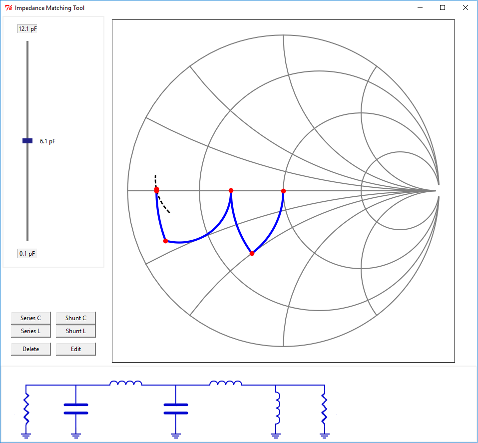

# SmithChartPy
SmithChartPy: Impedance Matching and Network Visualization Software

Numerous impedance matching tools exist, but all lack in numerous details that made me ask: why not write my own?

The main features this project aims to provide, for the time being: a frequency dependent curve of resulting network; variable loads (i.e. an s-parameter defined load); ability to include load-pull data in load definition in order to plot post-network contours; and lastly additional post-network plots (i.e. frequency vs. VSWR, frequency vs. impedance, frequency vs. return loss).

In addition, I am always interested in finding better graphical ways to visualize various circuit elements: lossy elements for example; or shunt series L-C networks.

